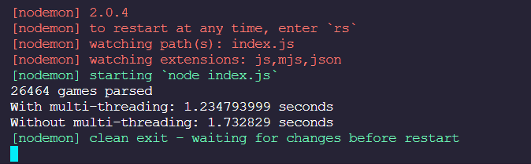

# OS-Project
An example usage of worker threads in Node.js to parse large PGN files. The project makes use of the ```chess-pgn-parser``` npm package to parse PGN files containing thousands of games and output a JSON file. The project attempts to compare the performance for the single-threaded and multi-threaded approach.

## Running the project locally
Make sure you have Node.js installed. Download the repository from github and then run:
- ```cd OS-Project```
- ```npm i```
- ```npm start```

## Parser Demo in Browser


## Project Demo in Node.js

Output of single-threaded version on the left and multi-threaded version on the right for a PGN file containing ~100,000 games.

## Benchmarking Output in Terminal

A comparison of the two approaches for a PGN file containing ~26,000 games.

## Results

<center>

Trial | Multi-threaded(s)  | Single-threaded(s)
:---: | :-----------:      | :-----------:
0     | 0.1875034          | 0.0635169
1     | 0.192108101        | 0.145554001
2     | 0.150625801        | 0.066774601
3     | 0.181777899        | 0.0724916

PGN File with 827 games

</center>

---

<center>

Trial | Multi-threaded(s)  | Single-threaded(s)
:---: | :-----------:      | :-----------:
0     | 0.214608           | 0.1311382
1     | 0.2279158          | 0.165930699
2     | 0.176748599        | 0.116851299
3     | 0.2525838          | 0.228234901

PGN File with 1654 games

</center>

---

<center>

Trial | Multi-threaded(s)  | Single-threaded(s)
:---: | :-----------:      | :-----------:
0     | 0.214608           | 0.1311382
1     | 0.2279158          | 0.165930699
2     | 0.176748599        | 0.116851299
3     | 0.2525838          | 0.228234901

PGN File with 1654 games

</center>

---

<center>

Trial | Multi-threaded(s)  | Single-threaded(s)
:---: | :-----------:      | :-----------:
0     | 2.996129099        | 3.862680001
1     | 2.594330399        | 3.5656342
2     | 3.1488285          | 3.507052801
3     | 3.0087395          | 3.8729383

PGN File with 52,928 games

</center>

---

<center>

Trial | Multi-threaded(s)  | Single-threaded(s)
:---: | :-----------:      | :-----------:
0     | 5.916030901        | 8.091521899
1     | 5.7170082          | 8.637040599
2     | 5.8032977          | 7.7143801
3     | 5.7086765          | 7.815089801

PGN File with 105,856 games

</center>


## Summary

<center>

Games   | Multi-threaded(s)  | Single-threaded(s)
:---:   | :-----------:      | :-----------:
827     | 0.17800380025      | 0.0870842755
1654    | 0.21796404975      | 0.16053877475
3308    | 0.2480372005       | 0.222979425
6616    | 0.3157451995       | 0.36413890025
13232   | 0.59284914975      | 0.700650525
26464   | 1.229599625        | 1.804482225
52928   | 2.9370068745       | 3.7020763255
105856  | 5.78625332525      | 8.06450809975

</center>


## Plot of games parsed vs the average time taken


Multi-threaded implementation performs significantly better than the single-threaded implementation for large PGN files.